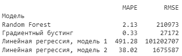

# LinearRegression

**«Построение модели ценообразования на рынке жилой недвижимости в Москве»**

# **1. Постановка задачи, обзор литературы, теоретическая модель.**

Тема работы: моделирование ценообразования на рынке жилой недвижимости в Москве для определенного округа и однокомнатной квартиры.

Задача: создание модели, которая будет обладать высокой предсказательной способностью и поможет понять основные факторы, влияющие на стоимость жилья в ЗАО.

Цель исследования: проверка сформированных гипотез и определение значимости каждого регрессора в объяснении изменчивости цен на однокомнатные квартиры в ЗАО. Это позволит заинтересованным сторонам принимать информированные решения при покупке или продаже недвижимости в данном округе Москвы.

Учитывая неоднородность зданий (т.е. разный год постройки), результатом которой является трудность оценивания спроса на здания в целом, мы будем опираться на концепцию гедонистических цен [Lancaster, 1966;  Rosen, 1976]. Согласно данному подходу, на стоимость недвижимости влияют не только внутренние параметры жилья (например, число комнат, этаж, наличие ремонта), но и внешние характеристики, отражающие качество инфраструктуры (доступ к паркам, транспортная инфраструктура, экологическая обстановка и т. д.) В критерии оценивания экологической обстановки вблизи недвижимости будет включаться концентрация оксида углерода, нахождение поблизости озелененных зон и промышленных предприятий.

В качестве теоретической модели для анализа ценообразования на рынке жилой недвижимости можно использовать множественную линейную регрессию. Такая модель позволит исследовать зависимость цены на жилье от различных факторов. Были сформированы следующие гипотезы:

1. Квартиры на первом или последнем стоят дешевле, чем квартиры не на этих этажах.
1. Районы с хорошей экологической обстановкой имеют более высокие цены на жилье.
1. Близость к общественному транспорту, такому как станции метро или остановки общественного транспорта, положительно влияет на цены на жилье.

# **2. Исходные данные, первичный анализ данных.**

В работе был использован достаточного объема набор данных с сайта [www.kaggle.com](http://www.kaggle.com), который в последствии был отфильтрован согласно критериям анализа. 

Данные, которые были отобраны для анализа:

'price\_doc', 'full\_sq', 'life\_sq', 'floor', 'max\_floor', 'build\_year', 'kremlin\_km', 'public\_transport\_station\_km', 'metro\_km\_walk', 'park\_km', 'green\_zone\_part', 'green\_zone\_km'

Рис. 1 - Изначальная совокупность всех отобранных данных

Исследование проводится на следующих районах: Дорогомилово, Крылатское, Кунцево, Можайское, Ново-Переделкино, Очаково-Матвеевское, Проспект Вернадского, Раменки, Солнцево, Тропарево-Никулино, Филевский Парк, Фили-Давыдково, Внуково. 

Произведем предварительную чистку данных: чтобы обнаружить, есть ли пропущенные данные в датасете мы проверяем, сколько строк имеют значения NaN, а затем удаляем их.

Логарифмируем зависимую переменную price\_doc чтобы уменьшить влияние выбросов на общую описательную статистику и перейти к относительной оценке.

Также готовая выборка была разделена на тестовую и обучающую в процентном соотношении: 20% тестовая выборка, 80% обучающая выборка.

Для анализа выбранных гипотез мы создаем две дамми-переменные:

first\_last\_floor - принимает значение 1, если квартира находится на первом или последнем этаже, 0 в обратном случае

metro\_close - принимает значение 1, если метро находится от квартиры на расстоянии менее 1.5 км, 0 в обратном случае

В ходе первичной обработки также накладываем ограничения на общую и жилую площадь full\_sq, life\_sq, предполагая, что площадь квартиры не может быть менее 10 кв.м. и более 200 кв.м.

Выводим финальный вариант сводной таблицы необходимых для анализа характеристик.

    Рис. 2 - Финальная таблица с данными после всех корректировок

# **3. Визуальный анализ данных и анализ описательных статистик.**

Проведем анализ описательных статистик переменных и их визуальный анализ (рис. 3)

Рис. 3 - Описательная статистика переменных.

Главный показатель для ценообразования, который оказывает наибольшее влияние на стоимость - это площадь квартиры. 

Средняя площадь 1-комнатных квартир в Москве равна 37 кв. м.. 

Минимальный метраж - 20 кв. м., максимальный метраж - 60 кв. М..

Минимальная цена квартиры равна 999 тыс. рублей, максимальная - 80 777 тыс. рублей, средняя цена -  5 483 тыс. рублей.

`  `Рис. 4 - Гистограммы (цен и кв метров, расстояния км и т.д.)

Строим гистограммы (рис. 4) и по ним определяем, какие показатели и в какой степени они истощают выборку. По внешнему виду гистограммы можно сразу предположить, если показатель истощает выборку, например, если на графике мало столбцов и в основном выделяется один длинный столбец. В таком случае у показателя мала вариация значений, из-за этого он истощает выборку.

У нас есть такие показатели - это full\_sq, life\_sq, num\_room, build\_age.

Меньше всего истощают выборку floor, public\_transport\_station\_km, metro\_km\_walk

По гистограммам нельзя сказать, что хотя бы один из показателей симметрично распределен. Независимые показатели распределены ассиметрично, при в основном с уклоном в правостороннюю асимметрию. Это значит, что в наблюдаемых данных среднее значение меньше, чем мода. Это может быть как из-за наличия выбросов в датасете, так и из-за того, что некоторые показатели не возрастают линейно.

Рис. 5 - Коэффициент вариации показателя для переменных.

Рассмотрим показатели коэффициента вариации для независимых переменных (рис. 5). Высоким разбросом значений в наборе данных обладают показатели life\_sq, max\_floor, kremlin\_km, public\_transport\_station\_km, metro\_km\_walk, park\_km, green\_zone\_part, green\_zone\_km. Для дамми-переменных разброс не рассматриваем, так как показатель принимает в таком случае значение 0 или 1. 

Разброс цены предполагаем тоже высоким. На данном этапе исследования price\_doc является уже логарифмированным, его разброс изучать необходимо по исходным данных.

Самый маленький разброс данных - у показателя build\_year.

`                                       `Рис. 6 - Корреляционная матрица.

Строим матрицу корреляции (рис. 6). По ней изучаем корреляцию между всеми переменными в наборе данных. 

Самая сильная корреляция у зависимой переменной наблюдается с переменными, которые представляют общую площадь квартиры, жилую площадь квартиры, этажность дома, расстояние до Кремля (т.е. до центра Москвы). 

Слабо коррелируют год постройки дома, расстояние до остановки общественного транспорта, близость к метро.

# **4. Поиск наилучшей функциональной формы.**

Нашей следующей целью является выявление распределения зависимой переменной. Сперва проведем на данных тест Шапиро-Уилка.

**Нулевая гипотеза (H0):** Распределение данных является нормальным (p-value > 0.05)

**Альтернативная гипотеза (H1):** Распределение данных не является нормальным (p-value < 0.05)

По boxplot видим неадекватное значение для build\_year года указаны в привычном представлении, а значение 3 и ниже являются выбросом.

Также и по значению price\_doc, значения являются не адекватными и находятся слишком далеко от “ящика”, наличие выбросов может привести к искаженным выводам о нормальности данных. Очищаем выбросы в build\_year и price\_doc.

Проводим после очистки от выбросов тест Шапиро-Уилка для логарифмированной модели (рис. 7), получаем значение p-value = 0.20 > 0.05, следовательно, мы не имеем достаточных оснований для отклонения нулевой гипотезы и можем сделать вывод, что данные могут быть нормально распределены. 

Рис. 7 - Тест Шапиро-Уилка для логарифмической модели.

Для линейной модели (рис. 8) значение p-value = 0.00000008, что меньше выбранного уровня значимости 0.05, следовательно для линейной модели мы отвергаем нулевую гипотезу о нормальном распределении данных.

Рис. 8 - Тест Шапиро-Уилка для линейной модели.

Далее для обеих моделей вычислим остатки, оценим их на нормальность распределения. Построим график остатков для логарифмической модели. Здесь на графике показано, что в целом остатки распределены произвольно по обе стороны от горизонтальной оси, за исключением некоторых выбросов внизу графика.

Рис. 9 - График остаточных и подобранных значений для логарифмической модели.

Строим график QQ (квантиль-квантиль) по остаткам модели. Чем точнее значения на нем лежат на диагональной линии, тем больше мы можем быть уверены в том, что распределение данных можно считать нормальным.

Для логарифмической модели распределение можно считать близким к нормальному.

Рис. 10 - График QQ остатков логарифмической модели.

Для линейной модели также построим графики остатков и квантиль-квантиль для сравнения с результатами логарифмической модели.

График остатков линейной модели выглядит очень похоже на график для логарифмической модели.

Рис. 11 - График остатков линейной модели.

Точки на графике QQ лежат в основном также вдоль диагональной линии, также как и для логарифмической модели есть разброс точек на хвостах графика, но они не вызывают серьезного беспокойства.

Рис. 12 - График QQ линейной модели

Рассмотрим результаты анализа двух моделей при помощи метода наименьших квадратов.

                     
` `Рис. 13 - Анализ логарифмической модели с помощью МНК

`    `Рис. 14 - Анализ линейной модели с помощью МНК

В результате анализа регрессии МНК для двух функциональных форм мы сделали следующие выводы:

1) В результате теста Шапиро-Уилка нулевая гипотеза была отклонена для линейной модели, но для логарифмической модели мы не можем ее отвергать
1) Наборы данных для двух моделей одинаково нормально распределены согласно графику остатков и графику QQ
1) F-статистика составляет 59.59 и 64.23 для логарифмической и линейной модели соответственно. P-value для F-статистики в обоих случаях меньше 0.05. Обе регрессии в целом значимы.

На основании полученных результатов в этой главе была выбрана для дальнейшего анализа **логарифмическая функциональная форма**. Дополнительным фактором для этого выбора послужило изначальное решение логарифмировать зависимую переменную в п. 2, где объяснено с какой целью это было сделано.

Находим в результирующей таблице для анализа МНК логарифмической модели столбец P > |t|. Показатели в столбце менее выбранного уровня значимости (0.05) являются значимыми. Это такие регрессоры как: full\_sq, max\_floor, first\_last\_floor, build\_year, kremlin\_km, public\_transport\_station\_km, metro\_close, park\_km.

Согласно значению R-squared из результатов МНК для логарифмической модели, 69.4% разброса зависимой переменной удалось объяснить.

# **5. Выбор оптимального набора регрессоров и учет структурной неоднородности.**

Постановка гипотез для теста Чоу:

**Нулевая гипотеза (H0):** Рассматриваемые подгруппы данных имеют одинаковую структуру или неоднородность отсутствует.

**Альтернативная гипотеза (H1):** Рассматриваемые подгруппы данных имеют различную структуру или присутствует неоднородность в данных.

Принимаем решение изучить подробнее показатель-признак того, что квартира находится на последнем или первом этаже. Сортируем набор данных по возрастанию значения столбца first\_last\_floor, находим индекс структурного разрыва и его используем в тесте Чоу. Это строка с индексом 269.

Проводим тест Чоу на двух моделях - полной, со всеми регрессорами, и с самыми значимыми: full\_sq, first\_last\_floor, kremlin\_km, metro\_close, park\_km.

Рис. 15 Тест Чоу на модели со всеми показателями

Рис. 16 Тест Чоу с самыми значимыми регрессорами 

В обоих случаях отвергаем нулевую гипотезу об отсутствии различия в двух подвыборках согласно тесту Чоу, так как p-value < 0.05 (что говорит о присутствии точки структурного разрыва).

Следовательно переменную first\_last\_floor следует включать в дальнейшем в обе модели для учета неоднородности в данных.

**Проведем тест на мультиколлинеарность VIF**, чтобы выяснить как сильно друг от друга зависят независимые переменные. Если в результате теста значение мультиколлинеарности более 5, переменную с таким показателем, возможно, лучше будет исключить, чтобы не нарушилась оценка регрессии. Значение VIF начинается с 1 и не имеет верхнего предела.

Рис. 17 - Результаты теста на мультиколлинеарность VIF.

Учитывая, что каждое из значений VIF для независимых переменных в нашей регрессионной модели не превышает 5, мультиколлинеарность в нашем примере не является проблемой.

**Тест Рамсея (RESET)**

Тест используется для проверки наличия нелинейной зависимости между объясняющими переменными и зависимой переменной в регрессионной модели.

**Нулевая гипотеза (H0):** В модели отсутствует нелинейная зависимость. То есть, линейная модель полностью описывает данные и не требуется включение дополнительных нелинейных компонентов.

**Альтернативная гипотеза (H1):** В модели присутствует нелинейная зависимость. То есть, линейная модель недостаточна для описания данных и требуется включение дополнительных нелинейных компонентов.

Если p-value < 0.05, то нулевая гипотеза отвергается в пользу альтернативной. 

Рис. 18 - Тест Рамсея на полной модели, со всеми регрессорами.

 Рис. 19 - Тест Рамсея с самыми значимыми регрессорами

У нас p-value > 0.05 следовательно результаты теста не предоставляют сильных доказательств в пользу наличия нелинейных компонент или других формальных ошибок в модели.

Из результатов тестов, проведенных в этом пункте, мы составили две модели. Одна включает в себя все потенциальные регрессоры из исходного набора данных. Вторая модель создана на основе значимых для ценообразования московских квартир критериев, таких как общая площадь квартиры, расстояния до центра, близкое расстояние до метро и до парков и нахождение квартиры не на первом или последнем этаже.

# **6. Выявление и коррекция гетероскедастичности и автокореляции.**

**Тест на гетероскедастичность Бройша-Пагана**

**Нулевая гипотеза (H0):** Ошибка модели гомоскедастична, то есть дисперсия ошибок постоянна для всех значений независимых переменных.

**Альтернативная гипотеза (H1):** Ошибка модели гетероскедастична, то есть дисперсия ошибок зависит от значений независимых переменных.

В случае p-value < 0.05, отвергаем нулевую гипотезу в пользу альтернативной.

` `Рис. 20 - Тест Бройша-Пагана для первой модели

` `Рис. 21 - Тест Бройша-Пагана для второй модели

В результате проведения теста на двух моделях, полученных в п. 5, значение p-value > 0.05 для обеих моделей, статистически значимых доказательств наличия гетероскедастичности не наблюдается. В таком случае, можно считать, что предположение о гомоскедастичности данных выполняется, и мы **не** можем отвергнуть нулевую гипотезу.

**Тест для выявления автокорреляции - Тест Дарбина-Уотсона**

Тест проводится также на остатках моделей. Результат принимает значение от 0 до 4.0, где значение близкое к 2.0 указывает на отсутствие автокорреляции.

Рис. 22 - Тест Дарбина-Уотсона для первой модели

` `Рис. 23 - Тест Дарбина-Уотсона для второй модели

У нас значение близко к 2.0, что указывает на отсутствие автокорреляции, у второй модели с мéньшим набором регрессоров результат ближе к 2.0, чем у первой модели.

# **7. Построение прогноза.**

MAPE (Mean Absolute Percentage Error) - это средняя абсолютная процентная ошибка. Она измеряет в процентах среднюю абсолютную разницу между фактическими и прогнозными значениями в процентах от фактических значений.

RMSE (Root Mean Square Error) - это квадратный корень из среднеквадратичной ошибки. Он измеряет среднеквадратичное отклонение между фактическими и прогнозными значениями и измеряется в единицах зависимой переменной, в данном случае - в рублях.

Оба значения являются абсолютом разницы между прогнозируемыми значениями и фактическими, и, соответственно, чем ближе эти показатели к нулю, тем ближе прогнозы к фактическим значениям.        

`    `
`             `Рис. 24 - Таблицы фактических и прогнозируемых значений для модели №1 и модели №2 

Для нашей первой модели получилось так, что MAPE и RMSE превышают любое адекватное значение, хоть и по столбцу прогноза, предсказанные значения выглядят нормально. В данном случае у нас есть некоторые нестандартные результаты прогноза, например, наблюдение №30266, для которого модель предсказала цену более чем в 100 раз превышаюшую фактическую величину.

Для второй модели результаты являются адекватными, но по-прежнему довольно высокими с MAPE равным 38% и RMSE равным 1 675 587 рублей. Это означает, что в ходе исследования мы составили не очень корректную и адекватную модель и, возможно, выбрали не те регрессоры. В целом по сравнению с первой моделью она лучше.

# **8. Бонусный пункт: сравнение с моделями машинного обучения.**
Используем для построения прогноза методы машинного обучения. Обучим модели на основе сырых данных, очищенных от выбросов данных и на основе результата обучения, полученного в п.7.

Для исследования были выбраны две модели машинного обучения: модель “Случайный лес” и модель градиентного бустинга. Сначала рассмотрим результаты первого из методов.

**Случайный лес**

Прогноз на сырых данных и на очищенных данных

Рис. 25 - Таблицы фактических и прогнозируемых значений, MAPE, RMSE для сырых и очищенных данных (модель ”Случайный лес”)

Прогноз на основе результата обучения в п.7

Рис. 26 - Таблица фактических и прогнозируемых значений, MAPE, RMSE для результатов обучающей выборки (модель ”Случайный лес”)

**Градиентный бустинг**

Прогноз на сырых и на очищенных данных

Рис. 27 - Таблицы фактических и прогнозируемых значений, MAPE, RMSE для сырых и очищенных данных (модель ”Градиентный бустинг”)

Прогноз на основе результата обучения в п.7

Рис. 28 - Таблица фактических и прогнозируемых значений, MAPE, RMSE для результатов обучающей выборки (модель ”Градиентный бустинг”)

Мы выбрали самой адекватной моделью вторую модель линейной регрессии. На сырых и очищенных данных полученные на основе машинного обучения результаты схожи с нашими результатами для второй модели. 

На основе финальных результатов, полученных в п.7, из моделей машинного обучения лучше всего справился с обучением метод градиентного бустинга с MAPE равным всего 0,3% и RMSE равным 27 171 рублей. Метод “случайный лес” справился хуже, у него RMSE равен 224 676 рублей.

# **9. Заключение.**
В проведенной работе был совершен анализ рынка недвижимости однокомнатных квартир в ЗАО. Использование исходных данных оказалось в целом без проблем и экстремальных выбросов было удалено мало.

Результаты построенной в данной работе модель линейной регрессии оказались не очень близки к фактическим данным, отклонение от факта составило более 1,5 млн. рублей в среднем. Возможно, в ходе выбора регрессоров было выбрано недостаточно показателей, и перед прогнозом стоило подробнее изучить данные.

Сводная таблица результатов оцененных моделей представлена на рисунке ниже.

Рис. 29 - Таблица оцененных моделей.

Выполним метод кросс-валидации, для оценки регрессионной модели на различных разбиениях данных и получения стабильных оценок.

Рис. 30 - Результаты кросс-валидации обучающих данных

Среднее значение оценок равно 0.13. По ней можно оценить насколько модель соответствует данным. Чем ближе к нулю - тем лучше. В нашем случае оценка близка к нулю.

Стандартное отклонение оценок равно 0.22. Чем ближе оценка к значению 0, тем более стабильные и согласованные оценки модели на различных разбиениях данных. В целом std\_score имеет приемлемое значение.

Из созданных моделей наиболее убедительной оказалась вторая модель линейной регрессии. 
